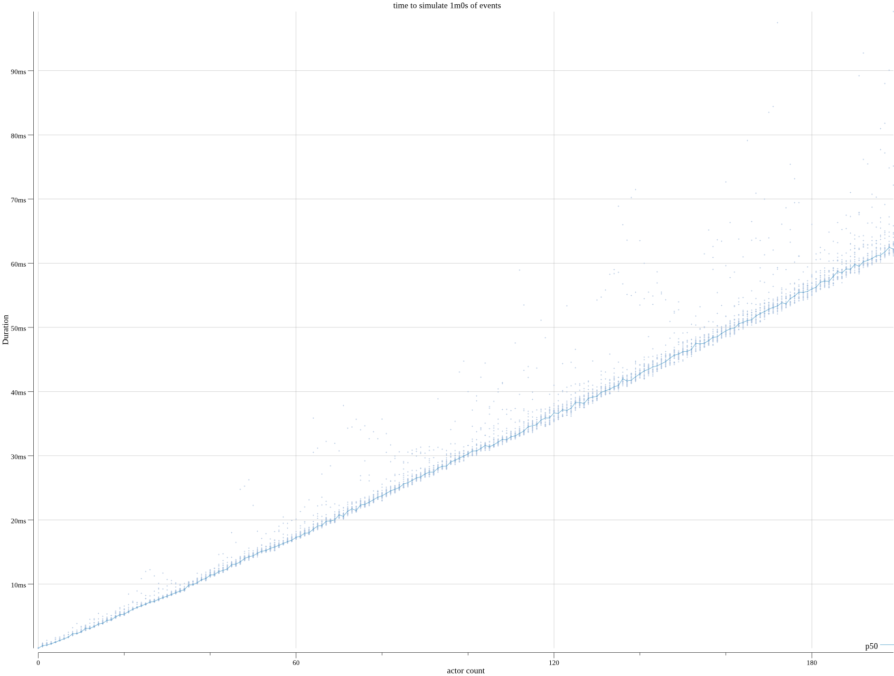
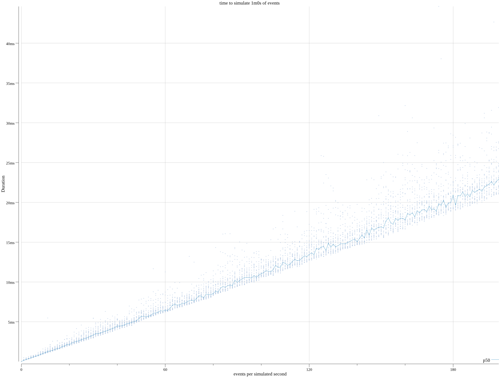

# desim
> Discrete Event Simulations

Focus on your model, `desim` handles the rest.

## about

`desim` is a framework that allows one to quickly produce programs that implement a simulation. `desim` takes care of scheduling events in a simulation and gathering results, and lets you focus on the model you want to simulate.

`desim` is a simple package for one off simulations, but long term is meant to become a development environment platform for distributed simulations.

## example


If you model a clock like this:

```go
func clock(iter int, dur time.Duration) desim.Action {
	pdur := gen.StaticDuration(dur)
	return func(env desim.Env) bool {
		iter--
		env.Log().Event("woke up, about to sleep")

		if env.Sleep(pdur) {
			env.Log().Event("couldn't sleep")
			return false
		}
		return iter > 0
	}
}
```

And would like to play a simulation with 2 clocks, a fast and a slow one:

```go
slowActor := desim.MakeActor("slow", clock(6, 1*time.Second))
fastActor := desim.MakeActor("fast", clock(6, 500*time.Millisecond))
```

You can! Just create an event scheduler, some parameters for time, and run your actors to see how they would behave:
```go
var (
	r     = rand.New(rand.NewSource(42))
	start = time.Unix(0, 0).UTC()
	end   = start.Add(10 * time.Second)
)

sim := desim.New(
	desim.NewLocalScheduler,
	r,
	gen.StaticTime(start),
	gen.StaticTime(end),
)

history := sim.Run(
	[]*desim.Actor{
		slowActor,
		fastActor,
	},
	desim.LogJSON(ioutil.Discard),
)
```

Where `history` represents what events were scheduled, and `desim.LogJSON` records what the actors have emitted during that time (in our case, that goes to `/dev/null`).

## performance

Simulations happen in simulated times: time goes as fast as possible. The speed at which the simulation runs grows linearly with the number of events happening over time.

For instance, if we simulate 1 hour worth of N actors performing events every 500ms, we see that the time it takes to simulate this hour is linear with the number of actors involved (and thus, with the frequency of events).



Similary, if we have a single actor simulation, but with the actor performing events at a fixed frequency, we see that this linear relation holds:




## license

MIT license
